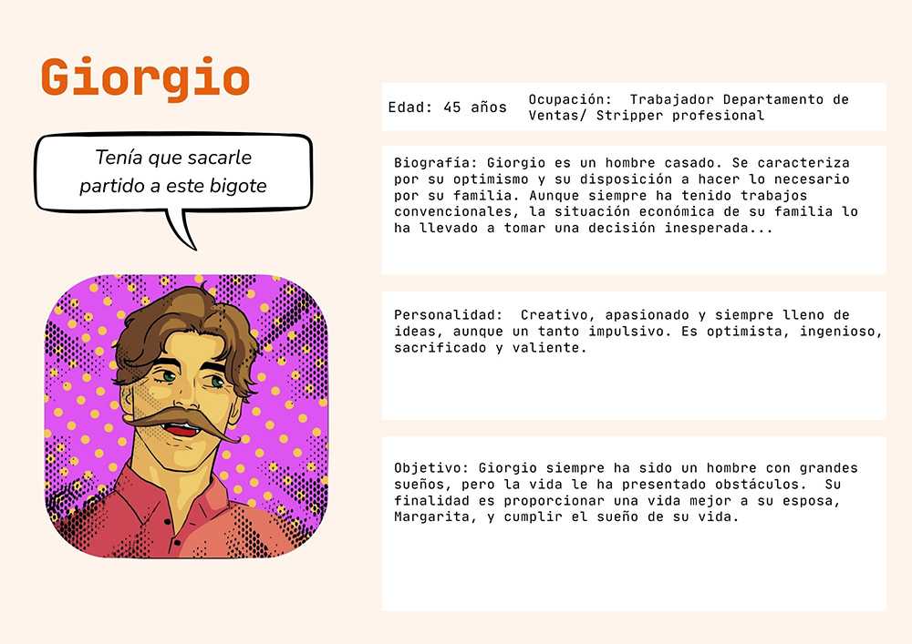

# Proyecto Storytelling (template): Gio, por amor todo. 
### giorgiomargarita 
Plantilla para crear mi historia interactiva de la asignatura [Creatividad e innovación Audiovisual](https://www.ugr.es/estudiantes/grados/grado-comunicacion-audiovisual/creacion-difusion-nuevos-contenidos-audiovis), repositorio de proyectos y documentación en https://github.com/mgea/storytelling

Autores:  
<!---
Incluir lista de personas del grupo 
Se puede añadir enlace a página personal de github o lo que se quiera...(optativo)
-->

- :woman: Irene Guirado Vera
- :woman: Maria Muros Castillo
- :man: Daniel Tomás Lucas
- :woman: Alicia Urquízar Rodríguez

Proyecto (código): 
URL (link) del proyecto en Github: 

Tipo/Género:  
- [ ] FictionCiberpunk  
- [ ] Reality/tribus urbanas  
- [x] Comic

## Resumen

### Personaje

### Historia

Giorgio, empleado de ventas, y Margarita, secretaria, son un matrimonio que atraviesa una difícil situación económica. Él, ante esta situación, se ve obligado a tomar una decisión en su vida profesional que pondrá a prueba su relación. Un día Margarita encuentra algo que la lleva a sospechar de su marido, llevándola a seguir su pista hasta el final. Playas paradisiacas, fiestas nocturnas, rostros desconocidos… Un misterio escondido tras las luces neón. ¿Será capaz este amor de superar la oscuridad de la noche?

### Enlace al juego interactivo

https://app.lumi.education/h5p/qu-personaje-eres-de-gio-por-amor-todo-b2pyb5

### TagLine

### Conflicto 

### Productos

- Personaje: (img personaje y enlace a interactivo) 

- Banner/Teaser: https://cloud.protopie.io/p/d17911eec7b2283556dbfdc6 

- Storytelling: https://arcweave.com/app/project/g16kJBxEYP/play

- Videogame: https://aliciaur.itch.io/gio-por-amor-todo

### Conclusiones/Valoración del equipo

------

<!---
Lista completa de emojis de markDown - https://gist.github.com/rxaviers/7360908) 
-->

Mayo, 2025

Proyecto dentro de la serie [Narrativas interactivas](https://github.com/mgea/storytelling/blob/master/What_is_a_digital_storytelling.md) 
Proyectos seleccionados de [2023](https://github.com/mgea/storytelling/tree/master/2023), [2022](https://github.com/mgea/storytelling/blob/master/2022/readme.md) / [2021](https://github.com/mgea/storytelling/blob/master/2021/readme.md) / [2020](https://github.com/mgea/storytelling/blob/master/2020/readme.md)  / 
[2019](https://github.com/mgea/storytelling/blob/master/2019/readme.md) / [2018](https://github.com/mgea/storytelling/blob/master/2018/readme.md) 

CC BYNCSA [Creatividad e Innovación Audiovisual-B](https://github.com/mgea/criav/)

 

[Facultad de Comunicación y Documentación](http://fcd.ugr.es)

Universidad de Granada
